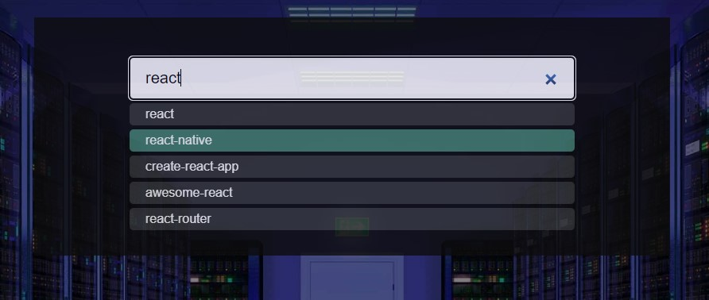

# Задание

Реализуйте приложение на чистом JavaScript без использования сторонних библиотек, которое будет работать с общедоступным API GitHub и представлять собой список репозиториев.
___
Итоговое решение должно состоять из двух элементов, расположенных на странице - поля ввода с автодополнением (автокомплита) и списка репозиториев:

* Автокомплит должен запрашивать данные о репозиториях через API GitHub, каждый раз, когда пользователь обновляет значение поля ввода и выводить их в выпадающем меню прямо под собой. В выпадающем меню должно быть перечислено 5 названий первых репозиториев, полученных с помощью запроса поиска репозиториев по ключевым словам API GitHub с введенным пользователем в поле ввода поисковым запросом. При клике на любой из репозиториев соответствующий репозиторий должен быть представлен в списке добавленных репозиториев, расположенном ниже.

* Список репозиториев отображает добавленные с помощью автокомплита репозитории. Для каждого добавленного в список репозитория должно быть отображено его название, его владелец и количество звезд на этом репозитории. Кроме того, возле каждого пункта списка добавленных репозиториев должна быть кнопка удаления, которая, соответственно, удаляет репозиторий из списка.
___

Чтобы обеспечить хороший опыт работы с приложением для пользователей, необходимо сделать следующие улучшения для автокомплита:

1. Если поля ввода пустое, то список автодополнений не отображается
2. При вводе символов в поле ввода запросы не должны отправляться сразу в целях избежания лишних запросов на сервер. Используйте знания, полученные при решении задачи debounce, для решения этой проблемы
3. Когда пользователь добавляет репозиторий путем клика на его название в списке автокомплита, поле ввода должно очищаться.

### Скриншот готового приложения

* поиск по названию репозитория

* выбор из предложенного списка

* добавление репозитория в список

* удаление репозитория из списка
